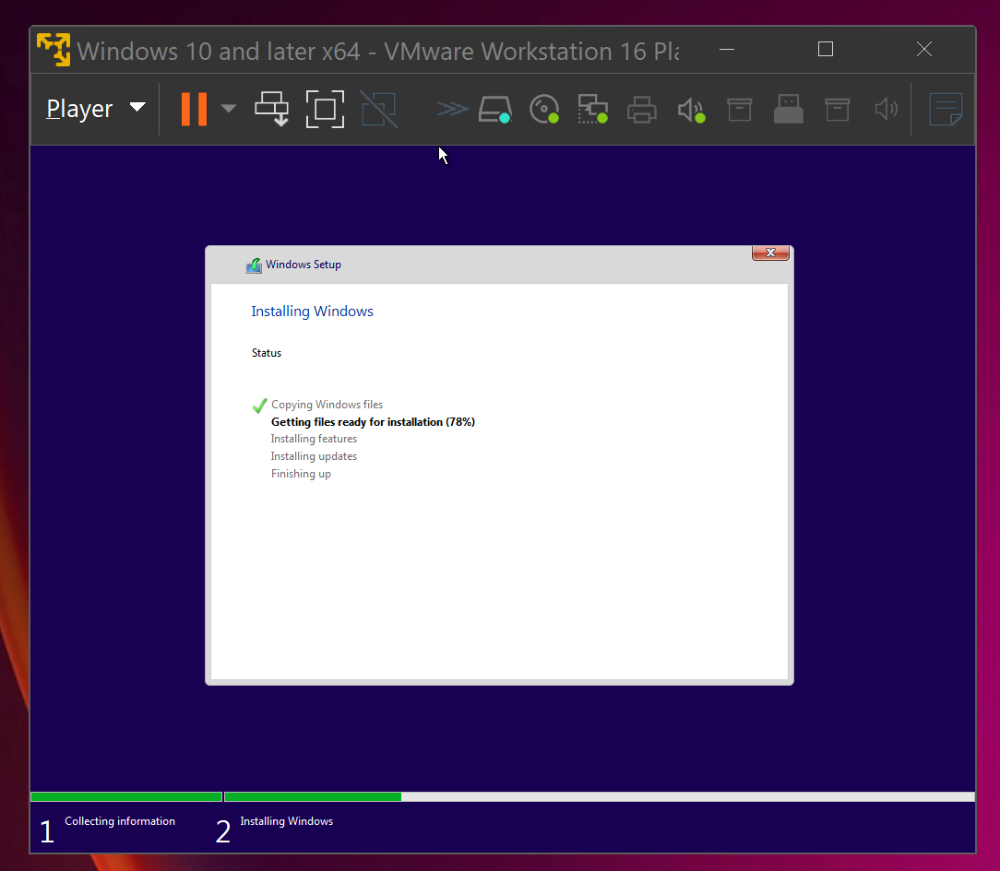
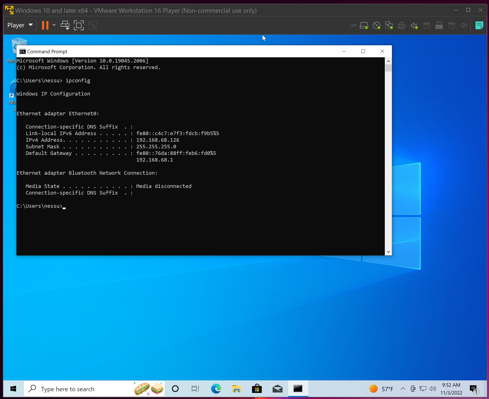
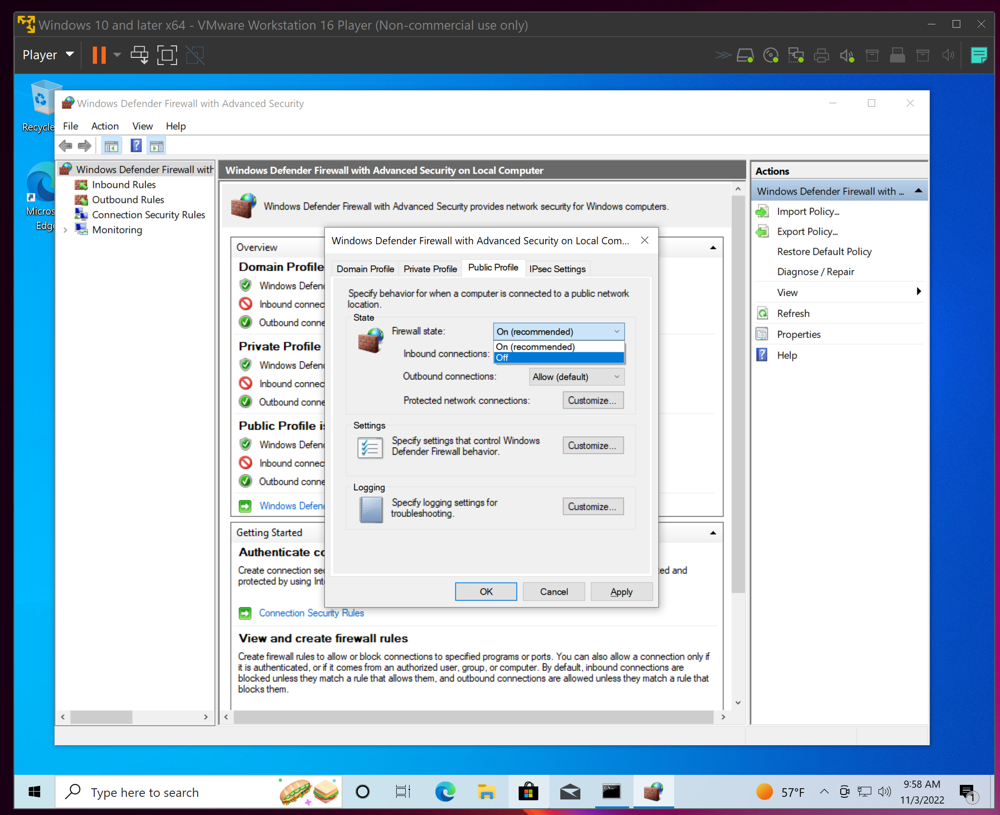
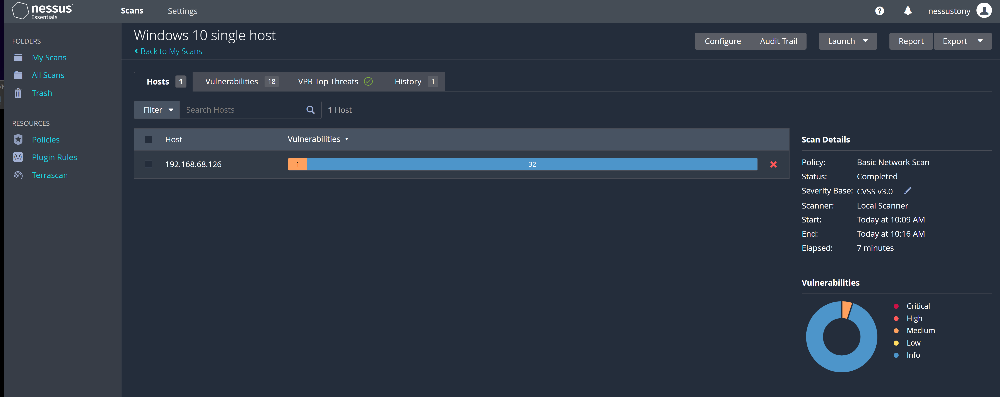
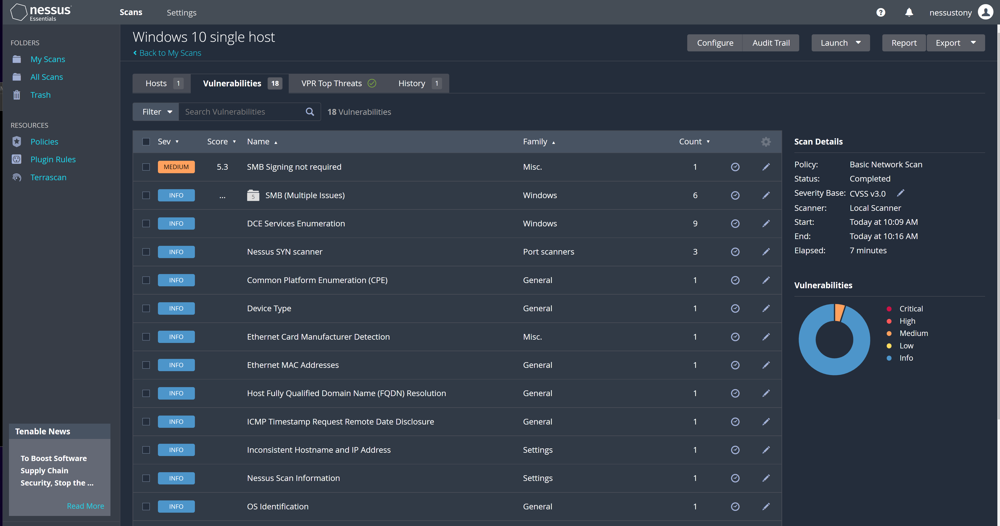

# Nessus Tutorial | Vulnerability Management (make your resume standout)
### Learning objectives:
1. Provisioning and deprovisioning virtual environments within VMware.
2. Run initial vulnerability scan using Nessus against vm and observe results.
3. Run a credentialed vulnerability scan and compare/contrast results.
4. Remediatation

### Technologies and Protocols:
* VMware Workstation 16 Player
* Nessus Essentials 
* Windows ISO + Firefox 3.6.12

> NOTE: This lab will be done on a Windows machine.
 
### Overview:

## Step 1.1: Signup and install [Nessus Essentials](https://www.tenable.com/products/nessus/nessus-essentials)
- Register for an account
- You will receive an activation code in your email
- Copy your activation code in your email and click the Download Nessus as well
- Choose Nessus > View Downloads 
- Under version chose Nessus - 8.15.6
- Under platform choose Windows - x86_64 **make sure it includes Server 2012 R2, 7,8,10**
- Open Tenable Nessus and click next and install
- After finishing installation and window should pop up with a local host URL 
- Copy/paste the URL for future use 

## Step 1.2: Finish Nessus installation 
- click Connect via SSL on web page 
- Click Advance on warning page > continue to localhost > Nessus Essentials 
- Click skip on Get an activation code (we already have ours)
- Paste activation code > continue 
- Create a username and password **remember for future use**
- Click submit > and wait for download 
- Let’s download the rest of our tools while we wait

## Step 2: Download [Windows 10 ISO file](https://www.microsoft.com/en-us/software-download/windows10)
- click download now and open file 
- Accept license terms and chose Choose Create installation …
- finish setup and chose ISO file 
- Wait for download and click finish

## Step 3: Download [VMware Workstaion 16 Player](https://www.vmware.com/products/workstation-player/workstation-player-evaluation.html)

## Step 4: Setup virtual machine
- open up VMware workstation 
- Click Player > file > new virtual machine 
- For the Installer disc image file (ISO) browse and select your windows 10 ISO. 
- Hit next > next > maximum disk size is fine > customize hardware
- Under customize hardware > select 4 GB of RAM 
- Under Network adapter choose *Bridged*
- Click close and finish 
- Open your vm and follow the steps to install Windows 
- **remember your user name and password** when you create an account 

## Step 5.1: Configure vm
- let’s scan our vm to see if you get any response - later we’ll do a more powerful credential scan 
- Go to your vm and search CMD to open the command line > use `ipconfig` to get your ipv4 address.

## Step 5.2: Configure vm (cont.)
- in your vm search mf.msc > windows defender firewall properties 
- Under Domain profile tab, private profile tab and public profile tab turn the firewalls OFF.

## Step 5.3: check for connectivity 
- in your *host* machine ping your vm - with firewalls off this should work!

## Step 6: Basic Nessus Scan
- sign into Nessus Essentials and click Create a new scan 
- Under vulnerabilities choose Basic Network Scan
- Name it Windows 10 Single Host and paste the *vm* ip in the targets field. 
- Leave the rest of the setting alone 
- Hit save, you should see the scan we just configured on the next page 
- Scroll over and hit the play button …
- Give it a second to scan 

## Step 7: Basic scan results 
- If you click on the scan we can look at the details of the results. 
- Not much information is brought back but still some interesting fields.

- If we click vulnerabilities tab we see 1 medium sever vulnerability. 
- Most look like to be basic info vulnerabilities - just Nessus giving us a heads up. 

